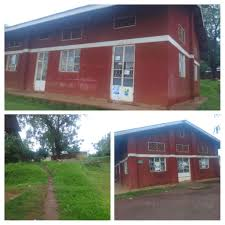

# Image Optimization Guide for Nature Properties Website

## ⚠️ CRITICAL: Your images are likely causing the lagging!

### Current Issues:
1. **Large file sizes** - JPEG images from WhatsApp are typically 2-5MB each
2. **No compression** - Images are not optimized for web
3. **High resolution** - Images may be 3000x2000px+ when you only need 1200x800px
4. **Multiple large images loading at once** - Hero slider, property images, banner images

## 🚀 Quick Fixes (Do These First!)

### 1. Compress Your Images
**Use these free tools:**
- **TinyPNG** (https://tinypng.com/) - Compresses JPEG and PNG
- **Squoosh** (https://squoosh.app/) - Google's image compressor
- **ImageOptim** (Mac) or **FileOptimizer** (Windows)

**Target sizes:**
- Hero slider images: **Max 500KB** (1200x800px)
- Property images: **Max 200KB** (800x600px)
- Logo: **Max 50KB** (300x120px)
- Testimonial avatars: **Max 30KB** (120x120px)
- Banner images: **Max 300KB** (1200x400px)

### 2. Resize Images Before Uploading
**Current problem:** You're using full-resolution images (possibly 4000x3000px) when you only need:
- Hero images: **1920x1080px** (or 1200x800px)
- Property images: **800x600px**
- Banner: **1200x400px**

**How to resize:**
1. Use **Photoshop**, **GIMP** (free), or online tools
2. Resize to the dimensions above
3. Save at **80% quality** for JPEG
4. Use **WebP format** if possible (smaller file size)

### 3. Convert to WebP Format (Best Option!)
WebP images are **25-35% smaller** than JPEG with same quality.

**Tools:**
- **Squoosh** (https://squoosh.app/) - Convert to WebP
- **CloudConvert** (https://cloudconvert.com/jpg-to-webp)

**After converting, update HTML:**
```html
<!-- Instead of: -->


<!-- Use: -->
<picture>
  <source srcset="images/house2.webp" type="image/webp">
  
</picture>
```

### 4. Optimize These Specific Images

**Priority order (biggest impact first):**

1. **Hero Slider Images** (Most critical!)
   - `images/plations-01.jpg` - Resize to 1920x1080px, compress to <500KB
   - `images/office1.jpeg` - Resize to 1920x1080px, compress to <500KB

2. **Banner Image**
   - `images/IMAGE2-01.jpg` - Resize to 1200x400px, compress to <300KB

3. **Property Images**
   - `images/house2.jpg` - Resize to 800x600px, compress to <200KB
   - `images/house3.jpg` - Resize to 800x600px, compress to <200KB
   - `images/house4.jpg` - Resize to 800x600px, compress to <200KB

4. **Logo**
   - `images/NATURE PROBERTIES LOGO-01.jpg` - Resize to 300x120px, compress to <50KB

## 📊 Expected Results

**Before optimization:**
- Total image size: ~10-15MB
- Page load time: 5-10 seconds
- Lagging and freezing

**After optimization:**
- Total image size: ~1-2MB
- Page load time: 1-2 seconds
- Smooth performance

## 🛠️ Step-by-Step Action Plan

### Step 1: Compress Hero Images (Do this NOW!)
1. Go to https://tinypng.com/
2. Upload `plations-01.jpg` and `office1.jpeg`
3. Download compressed versions
4. Replace files in `images/` folder

### Step 2: Resize Images
1. Open each image in an image editor
2. Resize to recommended dimensions above
3. Save with 80% quality
4. Replace original files

### Step 3: Test Performance
1. Clear browser cache
2. Reload website
3. Check if lagging is reduced

### Step 4: Convert to WebP (Optional but Recommended)
1. Use Squoosh.app to convert images
2. Keep both .jpg and .webp versions
3. Update HTML to use WebP with fallback

## ⚡ Quick Win: Use This Command (If you have ImageMagick)

```bash
# Resize and compress all images at once
magick mogrify -resize 1920x1080> -quality 80 -strip images/*.jpg
magick mogrify -resize 1920x1080> -quality 80 -strip images/*.jpeg
```

## 📝 Checklist

- [ ] Compress hero slider images (plations-01.jpg, office1.jpeg)
- [ ] Compress banner image (IMAGE2-01.jpg)
- [ ] Compress property images (house2.jpg, house3.jpg, house4.jpg)
- [ ] Compress logo (NATURE PROBERTIES LOGO-01.jpg)
- [ ] Resize all images to recommended dimensions
- [ ] Test website performance
- [ ] (Optional) Convert to WebP format

## 🎯 Target File Sizes

| Image Type | Current Size | Target Size | Reduction |
|------------|--------------|-------------|------------|
| Hero Images | ~3-5MB | <500KB | 90% smaller |
| Property Images | ~2-3MB | <200KB | 93% smaller |
| Banner | ~2-3MB | <300KB | 90% smaller |
| Logo | ~500KB | <50KB | 90% smaller |

**Total reduction: From ~10-15MB to ~1-2MB (85-90% smaller!)**

## 💡 Pro Tips

1. **Always compress before uploading** - Don't upload full-size images
2. **Use WebP when possible** - Better compression than JPEG
3. **Lazy load below-fold images** - Already implemented ✓
4. **Use appropriate dimensions** - Don't use 4000px wide images for 800px containers
5. **Monitor file sizes** - Keep images under recommended sizes

## 🔍 How to Check Current Image Sizes

1. Right-click image file → Properties (Windows) or Get Info (Mac)
2. Check "Size" - if it's over 500KB, it needs compression
3. Use online tools to check dimensions

---

**Remember:** Large images are THE #1 cause of website lagging. Compressing your images will have the biggest impact on performance!

